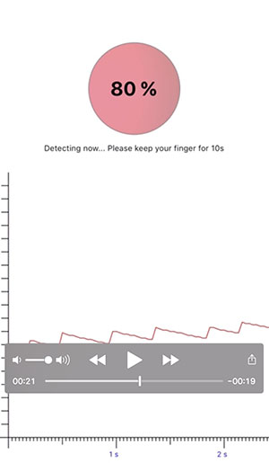

# HeartbeatGraph_iOS

# Created by

**_name_**:		_KmHk_

**_email_**:	[_kmhk.lu@aol.com_](mailto:kmhk.lu@aol.com)

**_git_**:		[_kmhk_](https://github.com/kmhk)

# Overview

This is the sample health app to check heart beat and generate graph using SVG.

# Skills

  - check heart-beat using camera
  - generate graph and save to SVG file

# Screen Video

